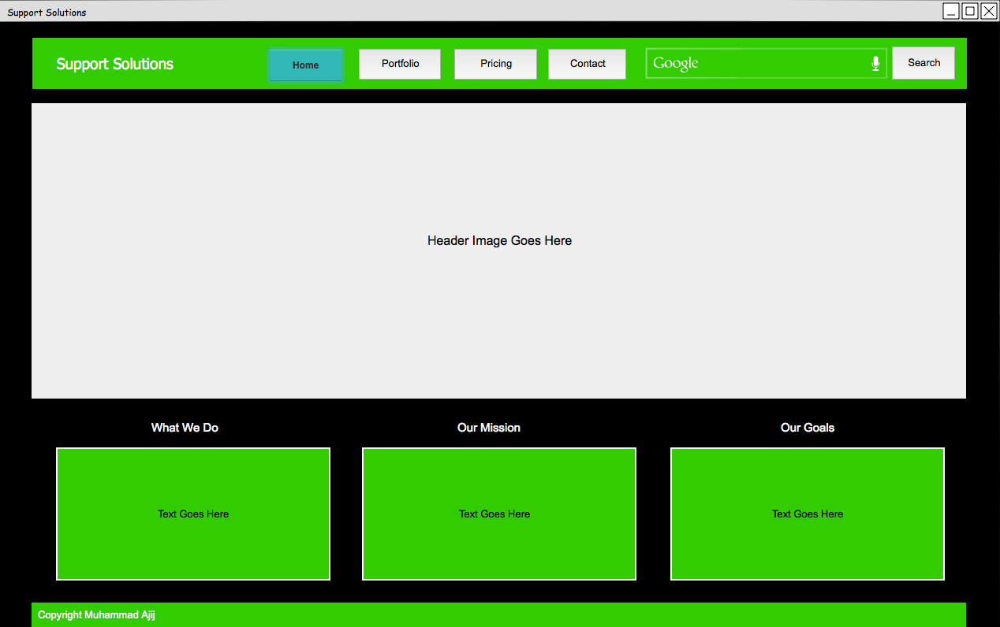
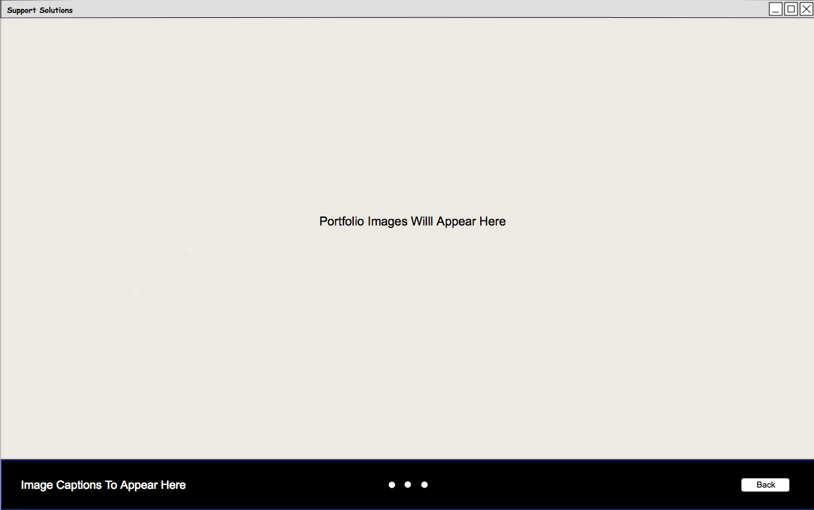
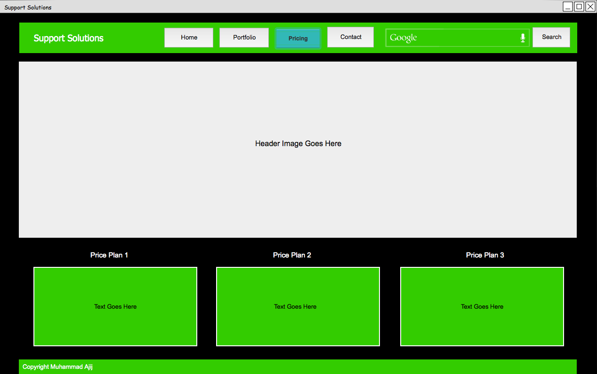
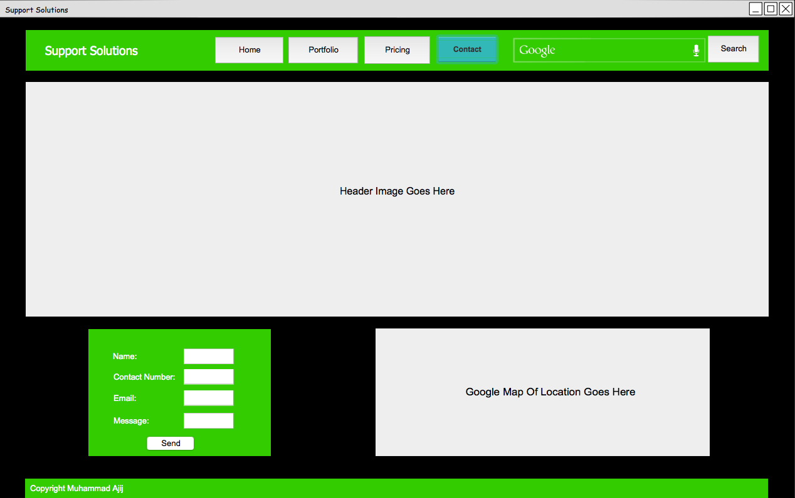

# Initial Designs

The following will cover the initial wireframe sketches that were developed to aid construction for the support solution website that was created. The idea was to have multiple html files for each page, with minimal use of third party code such as bootstrap.

[Back](../../README.md)

## Home Page

A thoroughly animated and simple homepage that grabs the users attention straight away, with a slideshow enabled header, loading different images at a declared interval. In regards to the navigation bar the use of FontAwesome will be used to apply stylish icons. Keyframes will be used throughout the website to animate features.

*Wireframe design of the proposed layout of Home Page*

## Portfolio Page

A gallery made through carousel allowing users to click through and view images, also having the ability to return back to the previous page with the aid of javascript.

*Wireframe design of the proposed layout of Portfolio Page*

## Pricing Page

Another thoroughly animated and simple page that displays three different price plans the users can sign up to.

*Wireframe design of the proposed layout of Home Page*

## Contact Page

This page once again will be well animated with providing users to fill out contact form, an attempt to make this function by sending emails may be made if time is not scarce. The location of the company will be made as De Montfort University, it will be generated by using Google Maps API.

*Wireframe design of the proposed layout of Contact Page*

_ _ _

[Back](../../README.md)