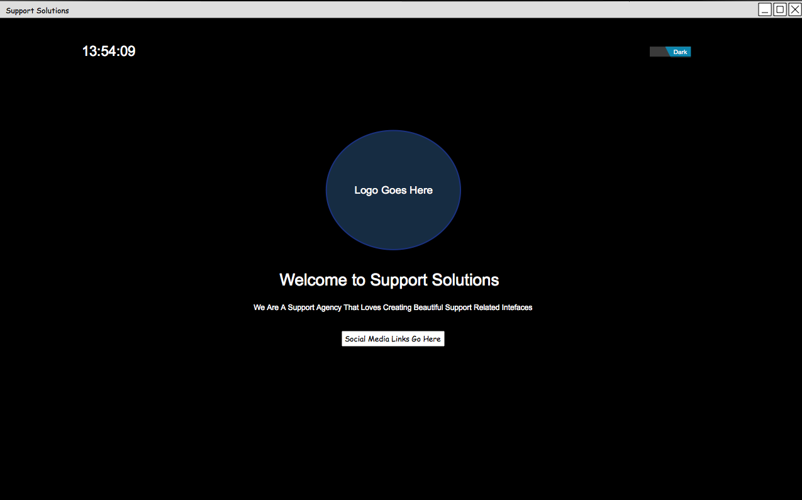
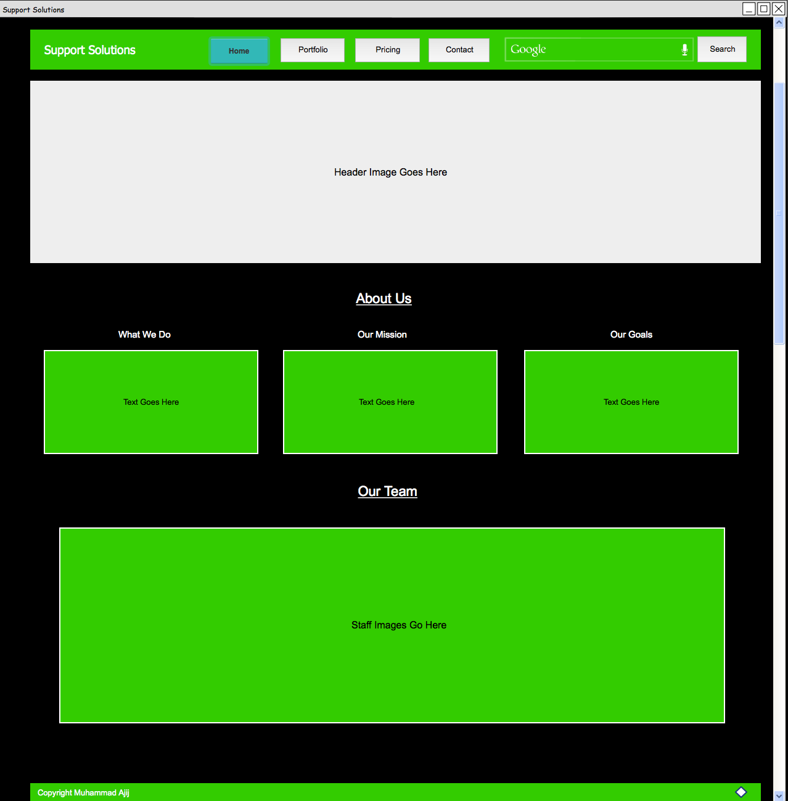
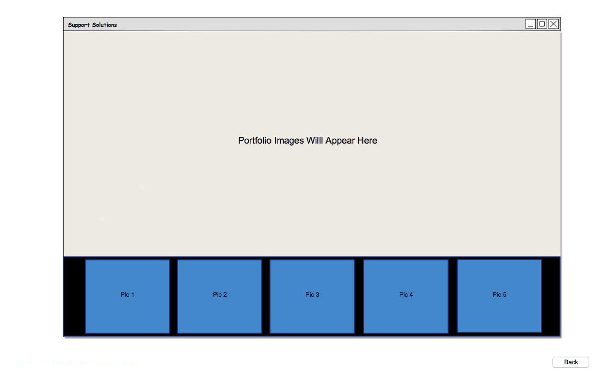
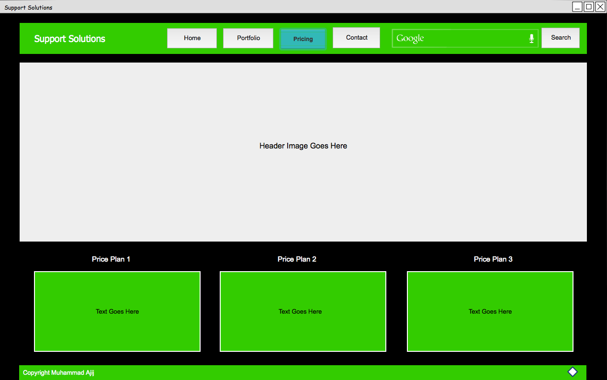
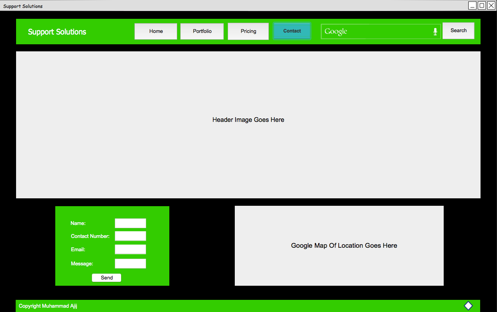
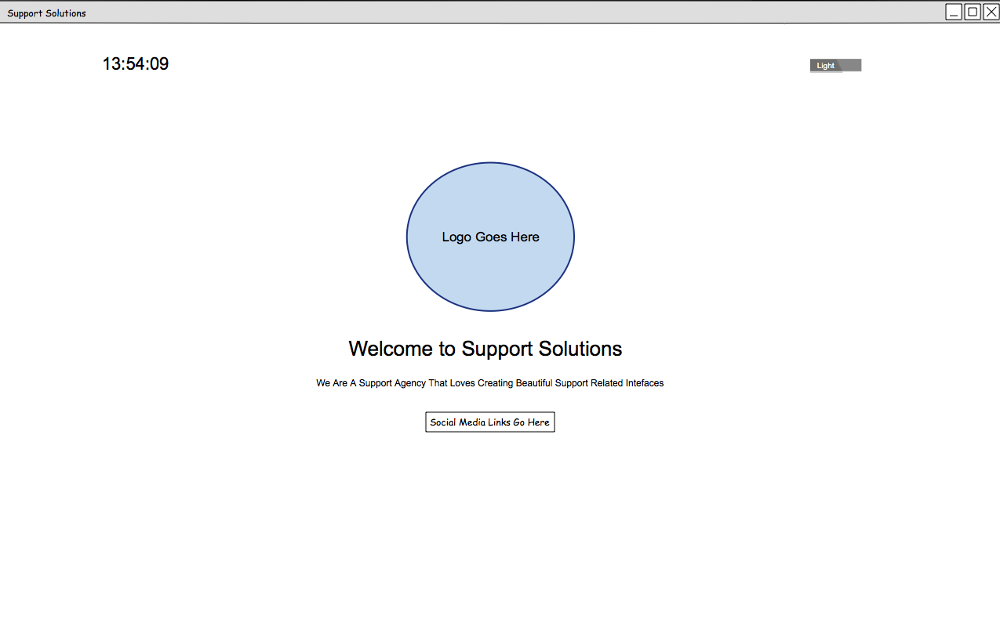

# Final Designs

The following will cover the final wireframe sketches that were developed to aid construction for the support solution website that was created, it will incorportate the use of bootstrap to assist with aligning features of the website.

[Back](../../README.md)

## Landing Page

To improve on the previous designs an asthetically pleasing landing page was designed, this lead to the change of having a website with multiple html documents to a SPA, whereby all sections of the website will be based in a index file. The inclusion of social media links will also be added, along with ability to change website theme. Upon entering the website it will locate to home, these different sections will implement the use of jQuery hide and show fuctionality.

*Wireframe design of the proposed layout of Landing Page*

## Home Page

Second design for homepage has minimal change. However, the addition of staff images will be visible. When clicked modal boxes should appear with information regarding the staff member. In the footer a button will be placed to allow the user to return back to the top of the webpage, again this will use jQuery smooth scrolling feature to enable this.

*Wireframe design of the improved layout of Home Page*

## Portfolio Page

Improving upon the previous design for the portfolio, it will have small images on the bottom to show the user what images are within the portfolio gallery. This will implement the use of modal image gallery, also known as lightbox.

*Wireframe design of the improved layout of Portfolio Page*

## Pricing Page

Improvements made for this page will only include the footer, whereby a button will be placed to allow the user to return back to the top of the webpage, this will use jQuery smooth scrolling feature to enable this.

*Wireframe design of the improved layout of Home Page*

## Contact Page

Again only improvement made on this page is the scroll to top button in the footer of the page. Also flexbox will be used to only show the contact us form when viewed on small device, this will allow the form to be centered.

*Wireframe design of the improved layout of Contact Page*

## Additional CSS Theme

The use of javascript again will aid this functionality, whereby the ability to alter stylesheets for the whole website will be implemented as buttons on the landing page.

*Wireframe design of the improved layout of Landing Page in light theme*

_ _ _

[Back](../../README.md)